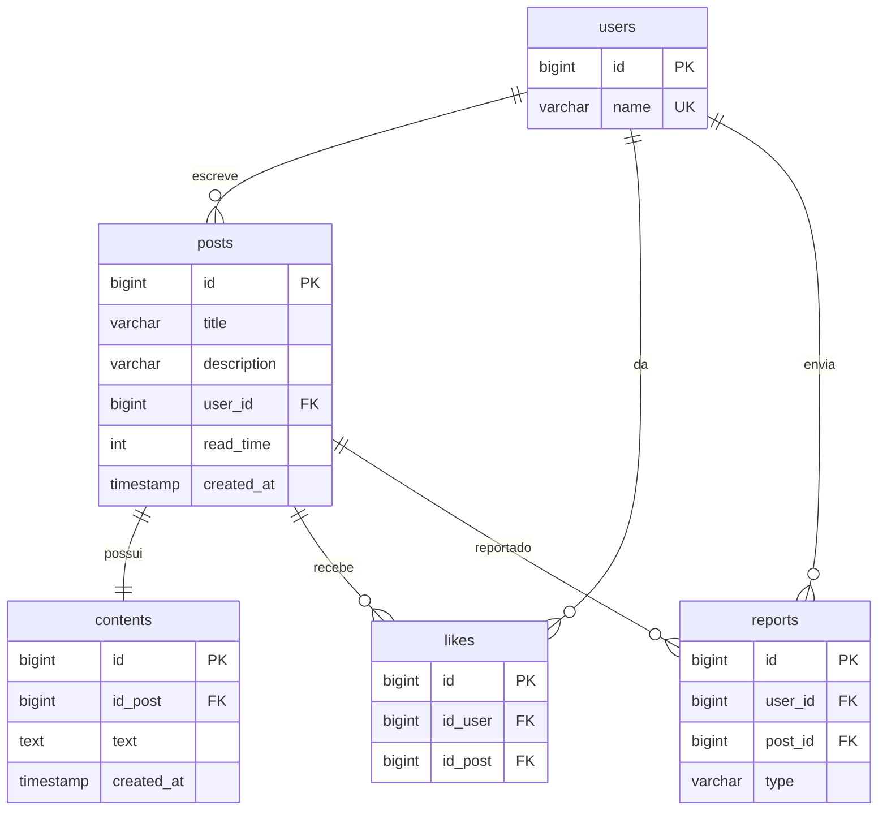

# OpenInk API

Uma API REST moderna e leve para uma plataforma colaborativa de escrita e publicação, desenvolvida com **Java 17** e **Spring Boot 3**.

O OpenInk permite que os usuários se cadastrem, publiquem artigos escritos em Markdown, curtam suas publicações favoritas e reportem conteúdos impróprios.

---

## Índice
1. [Tecnologias Utilizadas](#tecnologias-utilizadas)
2. [Modelo de Domínio e Esquema do Banco de Dados](#modelo-de-dominio-e-esquema-do-banco-de-dados)
3. [Configuração e Ambiente](#configuracao-e-ambiente)
4. [Como Começar](#como-comecar)
5. [Documentação da API](#documentacao-da-api)
6. [Regras de Validação de Dados](#regras-de-validacao-de-dados)
7. [Executando Testes](#executando-testes)

---

## Tecnologias Utilizadas

- **Framework Principal:** Spring Boot 3.5.x (Web, Security, Data JPA, Validation)
- **Linguagem de Programação:** Java 17
- **Banco de Dados:** PostgreSQL (Produção/Dev), Flyway (Migrações do Banco de Dados)
- **Autenticação:** JWT (JSON Web Tokens) usando Auth0 `java-jwt`
- **Documentação da API:** SpringDoc OpenAPI 2 (Swagger UI)
- **Utilitários do Desenvolvedor:** Lombok, `java-dotenv` (para gerenciamento de arquivos `.env`)
- **Testes:** JUnit 5, Spring Boot Test, Mockito

---

## Modelo de Domínio e Esquema do Banco de Dados

O banco de dados do OpenInk foi projetado em torno de cinco entidades principais: `User`, `Post`, `Content` (separando o texto markdown pesado dos metadados), `Like` e `Report`.

### Diagrama Entidade-Relacionamento (ERD)



> [!NOTE]
> Para otimizar o desempenho das consultas ao listar ou buscar posts (feed), o corpo principal em markdown (`text`) é armazenado separadamente na tabela `contents` e vinculado de volta à tabela `posts` (que contém apenas metadados).

---

## Configuração e Ambiente

A aplicação utiliza o `java-dotenv` para injetar variáveis de ambiente a partir de um arquivo `.env` na inicialização do sistema.

1. Copie o arquivo de configuração de exemplo:
   ```bash
   cp .env.example .env
   ```
2. Abra o arquivo `.env` e preencha com as credenciais do seu banco de dados PostgreSQL:
   ```env
   SPRING_DATASOURCE_URL=jdbc:postgresql://localhost:5432/openink?useSSL=false&serverTimezone=UTC
   SPRING_DATASOURCE_USERNAME=seu_usuario_do_banco
   SPRING_DATASOURCE_PASSWORD=sua_senha_do_banco
   SPRING_FLYWAY_ENABLED=true
   SECRET_TOKEN_API=sua-chave-secreta-jwt-customizada
   ```

---

## Como Começar

### Pré-requisitos
* Java Development Kit (JDK) 17 ou superior
* Apache Maven 3.8+
* Servidor PostgreSQL em execução localmente ou remotamente

### Passos para Executar
1. Crie um banco de dados PostgreSQL chamado `openink` (ou o nome configurado em `.env`).
2. Execute as migrações do Flyway e inicie o servidor Spring Boot usando o Maven Wrapper:
   ```bash
   # No Windows (PowerShell):
   .\mvnw.cmd spring-boot:run

   # No macOS / Linux:
   ./mvnw spring-boot:run
   ```
3. Uma vez iniciado, a API estará disponível em `http://localhost:8080`.
4. Acesse o Swagger UI para explorar a API interativamente:
   * **Swagger UI:** [http://localhost:8080/swagger-ui/index.html](http://localhost:8080/swagger-ui/index.html)
   * **Docs da API (JSON):** [http://localhost:8080/v3/api-docs](http://localhost:8080/v3/api-docs)

---

## Documentação da API

Todos os endpoints utilizam a URL base do servidor (ex: `http://localhost:8080`).

### 1. Autenticação (Público)
A autenticação utiliza registro/login sem senha. Se o nome de usuário fornecido não existir, um novo usuário é cadastrado automaticamente. Caso exista, ele é autenticado.

* **Autenticar / Cadastrar:** `POST /auth`
  * **Payload:**
    ```json
    {
      "name": "joao_silva"
    }
    ```
  * **Resposta:**
    ```json
    {
      "token": "eyJhbGciOiJIUzI1NiIsInR5cCI6IkpXVCJ9..."
    }
    ```

> [!IMPORTANT]
> Para acessar **endpoints protegidos**, você deve incluir o token retornado por `/auth` nos cabeçalhos da requisição:
> `Authorization: Bearer <seu_token_jwt>`

### 2. Usuários (Público)
* **Obter detalhes do usuário:** `GET /user/{id}`
  * **Resposta:**
    ```json
    {
      "id": 1,
      "name": "joao_silva"
    }
    ```

### 3. Publicações / Posts (Acesso Misto)
* **Listar Posts (Público - Paginado):** `GET /post?page=0&size=20&sort=createdAt,desc`
  * **Resposta:**
    ```json
    {
      "content": [
        {
          "id": 1,
          "title": "Primeiros passos com Spring Boot",
          "description": "Um guia prático sobre Spring Boot 3",
          "userId": 1,
          "readTime": 5,
          "createdAt": "2026-06-20T11:00:00"
        }
      ],
      "pageable": { ... },
      "totalElements": 1
    }
    ```
* **Obter detalhes de um Post (Público):** `GET /post/{id}`
* **Criar Post (Protegido 🔒):** `POST /post`
  * **Payload:**
    ```json
    {
      "title": "Primeiros passos com Spring Boot",
      "description": "Um guia prático sobre Spring Boot 3",
      "readTime": 5,
      "text": "O conteúdo em markdown deve vir aqui... (Mínimo de 90 caracteres formatados em markdown)"
    }
    ```

### 4. Conteúdos (Público)
* **Buscar Conteúdo Markdown por ID do Conteúdo:** `GET /contents/{id}`
* **Buscar Conteúdo Markdown por ID do Post:** `GET /contents/post/{idPost}`
  * **Resposta:**
    ```json
    {
      "id": 1,
      "idPost": 1,
      "text": "O conteúdo em markdown...",
      "createdAt": "2026-06-20T11:00:00"
    }
    ```

### 5. Curtidas / Likes (Acesso Misto)
* **Obter Total de Curtidas (Público):** `GET /posts/{postId}/likes`
  * **Resposta:**
    ```json
    {
      "numberLikes": 42
    }
    ```
* **Alternar Curtida (Protegido 🔒):** `POST /posts/{postId}/likes`
  * *Alterna (adiciona ou remove) a curtida na publicação para o usuário autenticado.*

### 6. Denúncias / Reports (Protegido 🔒)
* **Reportar uma Publicação:** `POST /report`
  * **Payload:**
    ```json
    {
      "postId": 1,
      "type": "CONTEUDO_IMPROPRIO"
    }
    ```
  * **Tipos de denúncias disponíveis:** `CONTEUDO_IMPROPRIO` (Conteúdo impróprio), `NOME_IMPROPRIO` (Nome de usuário impróprio), `OUTROS` (Outros motivos).

---

## Regras de Validação de Dados

A validação do Spring Boot é aplicada nos payloads de requisições `POST`:

| Payload | Campo | Regra | Mensagem de Erro |
|:---|:---|:---|:---|
| **CreatePostRequest** | `title` | Mínimo de 10 caracteres | *Tamanho mínimo para título é de 10 caracteres* |
| **CreatePostRequest** | `description` | Mínimo de 15 caracteres | *Tamanho mínimo para descrição é de 15 caracteres* |
| **CreatePostRequest** | `readTime` | Não Nulo | *Must not be null* |
| **CreatePostRequest** | `text` | Mínimo de 90 caracteres | *Tamanho mínimo para o markdown é de 90 caracteres* |
| **ReportRequest** | `postId` | Não Nulo | *Must not be null* |
| **ReportRequest** | `type` | Não Nulo (enum válido) | *Must not be null* |

---

## Executando Testes

Os testes unitários e de integração estão localizados no diretório `src/test`. Para executar a suíte de testes:

```bash
# Utilizando o Maven Wrapper
.\mvnw.cmd test  # No Windows
./mvnw test      # No macOS/Linux
```
